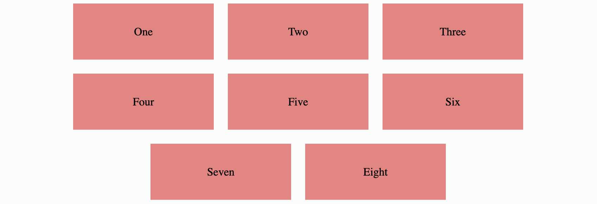

# Instructions  

---

Write some CSS to create the following graphic:

The vertical and horizontal space between the divs
are both 20px. You will need to use align/justify to
arrange the boxes in the middle of the screen like in
the screenshot. You will also need to use align/justify
to center the text inside each box.

Once you make this graphic, play around with it! 
Try different values and see how it arranges
your elements.